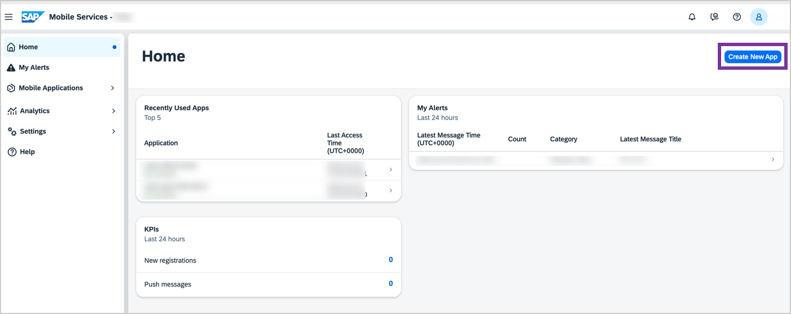
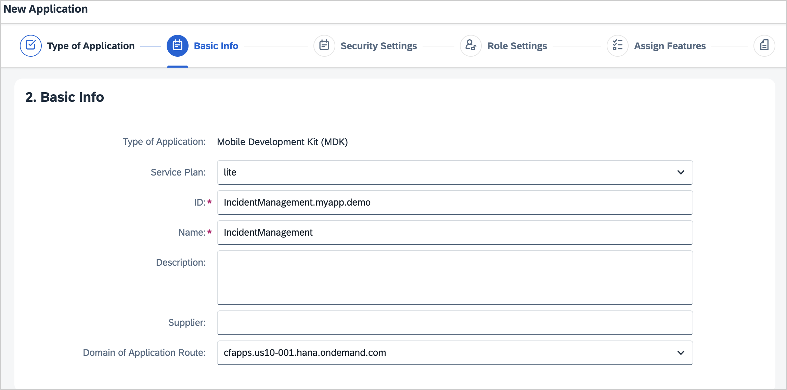
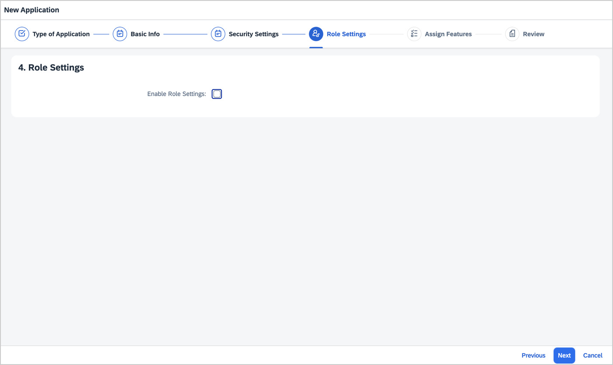
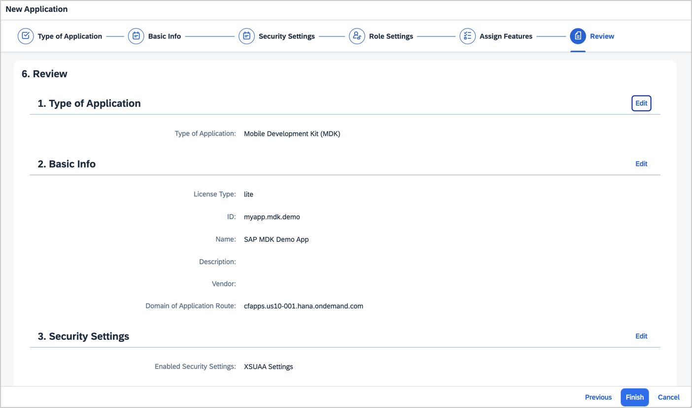
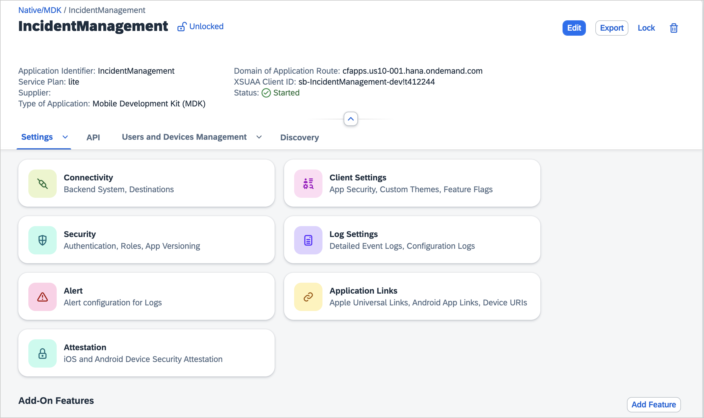
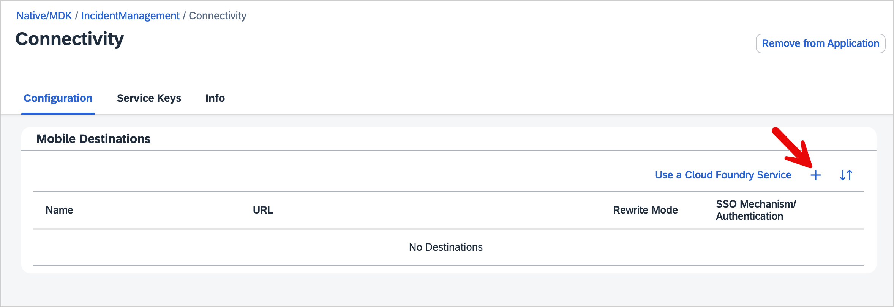
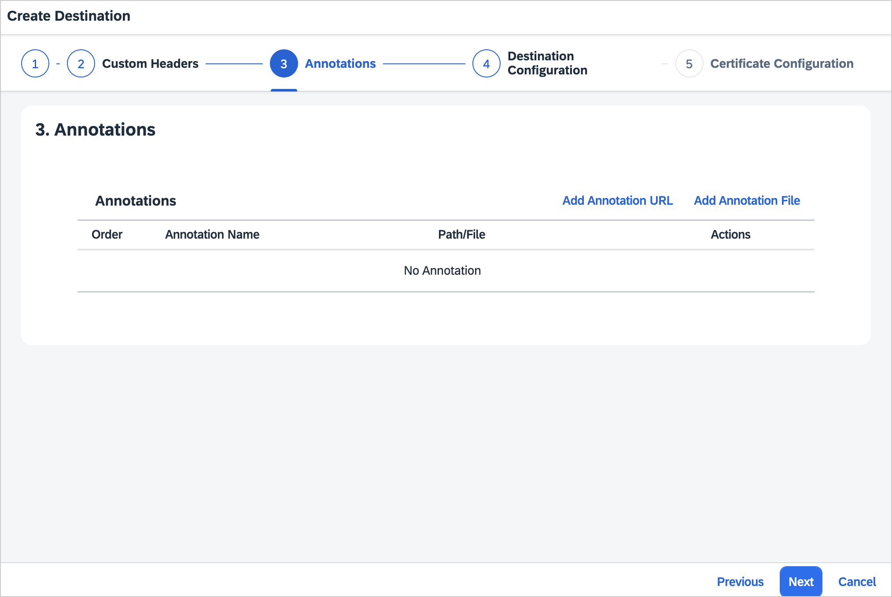
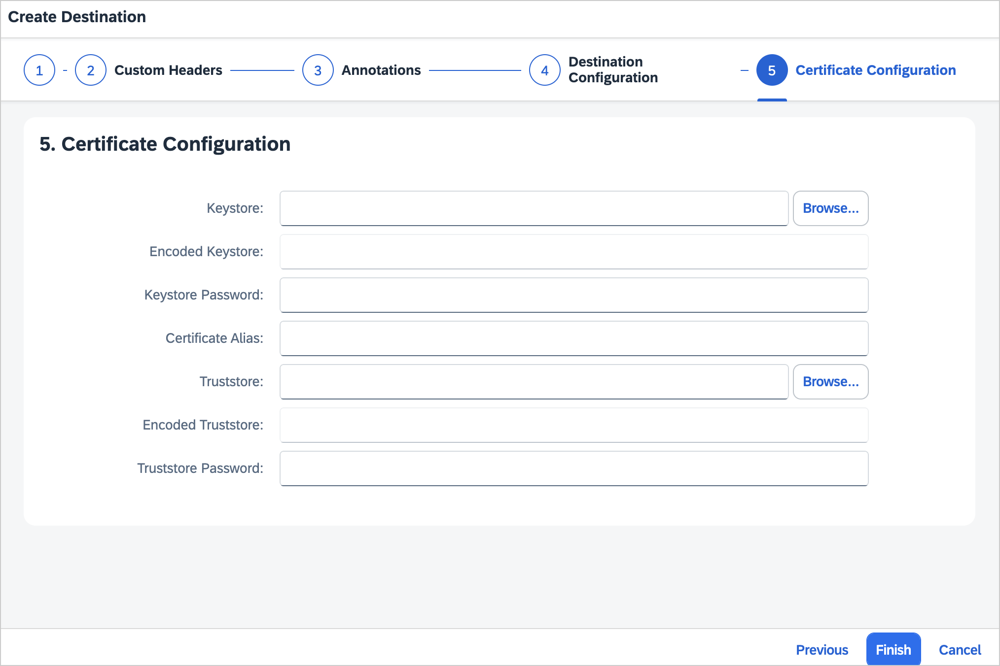

# Prerequisites

Before proceeding with the session exercises, please ensure you complete the following prerequisites for a seamless experience.

### Create a Trial Account in US10 Region

To begin using SAP Mobile Services, you'll first need to create a free trial account on SAP's platform. This will allow you to explore the various services and tools offered by SAP.

[Learn how to create a Trial Account](https://developers.sap.com/tutorials/hcp-create-trial-account.html "https://developers.sap.com/tutorials/hcp-create-trial-account.html")

### Run the Booster

After setting up your trial account, the next step is to run the booster. Boosters help automate the setup of development environments, allowing you to quickly configure the services and tools necessary for your project.

[Instructions to Run the Booster](https://developers.sap.com/tutorials/build-code-setup.html "https://developers.sap.com/tutorials/build-code-setup.html")

### Access Mobile Services

To build and deploy your mobile applications, you need access to SAP Mobile Services. This step involves setting up your environment to integrate with SAP's mobile technologies.

[Follow this guide to Access Mobile Services](https://developers.sap.com/tutorials/fiori-ios-hcpms-setup.html "https://developers.sap.com/tutorials/fiori-ios-hcpms-setup.html")

### Set Up New MDK App Configuration in the Mobile Services Admin UI

Ensure you have completed all required prerequisites as mentioned in this tutorial.

1. Navigate to the SAP Mobile Services Admin UI.

2. On the home screen, click **Create New App**
   
    

3. In the **Type of Application** step, select the **Mobile Development Kit (MDK)** and choose **Next**.

    

4. In the **Basic Info** step, provide the required information and choose **Next**.

    | Field | Value |
    |----|----|
    | `ID` | IncidentManagement.myapp.demo |
    | `Name` | IncidentManagement |

    

5. In the **Security Settings** step, continue with the default settings and choose **Next**.

    

5. In the **Role Settings** step, continue with the default settings and choose **Next**.

     

6. In the **Assign Features** step, continue with the default settings and choose **Next**.

     

7. In the **Review** step, verify the details of the application definition you are creating. Ensure all details are correct. If necessary, click Edit to make any necessary modifications. Choose **Finish** to create the mobile application configuration. This process may take 2-3 minutes.

    

    >If you see a _Application is without Role Settings_ warning message, choose **OK**. You may assign roles after the app has been configured if needed.

    Once your application is created, you will see a list of default features automatically assigned to the app.

    

### Configure Destination

In the next steps we will configure our backend destination.
1. Go to `Connectivity`

   

2. Click the **+** button

   

3. In the **Basic Info** step, provide the required information and click **Next**.

    | Field | Value |
    |----|----|
    | `Destination Name` | IncidentManagement |
    | `Destination Type` | Internet Destination |
    | `URL`| https://pm-mobile-teched-2023-demos-mobilet23-dev-mobileinciden4492b2c1.cfapps.ap11.hana.ondemand.com/service/IncidentManagementMobile/ |

    
    
4. In the **Custom Headers** step, continue with the default settings and choose **Next**.

   

5. In the **Annotations** step, continue with the default settings and choose **Next**.

   

6. In the **Destination Configuration** step, continue with the default settings and choose **Next**.

   

7. In the **Certificate Configuration** step, continue with the default settings and choose **Finish**.

   

### Download SAP Mobile Services Client
Before beginning the session exercises, ensure that you have installed the **SAP Mobile Services Client** app from the public store. You can expedite the installation process using the provided QR codes.

|            App             |        Android         |          iOS           |
| :------------------------: | :--------------------: | :--------------------: |
| SAP Mobile Services Client |  |  |

## Navigation

| Next |
|---|
| [Exercise 1](../ex1/README.md) |
