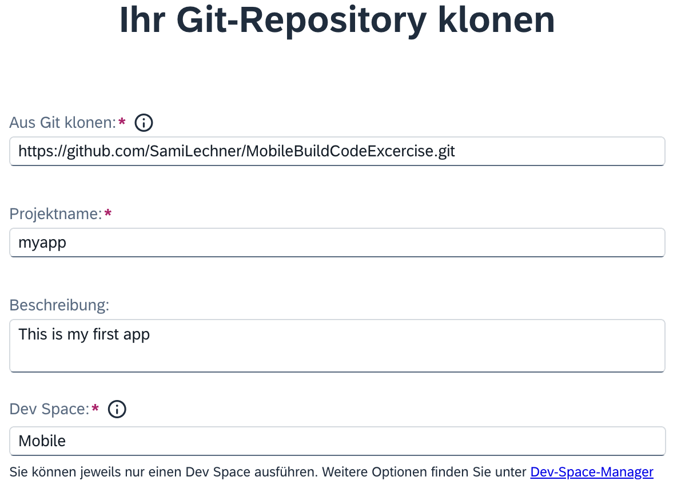

# Exercise 1 - Run the Starting Application on Your Device

In this exercise, you will run a starting SAP Mobile Development Kit (MDK) application on your device.

- [Exercise 1.1 - Launch the SAP Business Application Studio for MDK Development](#exercise-11---launch-the-sap-business-application-studio-for-mdk-development)
- [Exercise 1.2 - Change the workspace to the Project Explorer](#exercise-12---change-the-workspace-to-the-project-explorer)
- [Exercise 1.3 - Deploy the Project](#exercise-13---deploy-the-project)
- [Exercise 1.4 - Display the QR code for onboarding the Mobile app](#exercise-14---display-the-qr-code-for-onboarding-the-mobile-app)
- [Exercise 1.5 - Run the app](#exercise-15---run-the-app)

### Exercise 1.1 - Launch the SAP Business Application Studio for MDK Development

1. In the BTP cockpit, navigate to the **Services** > **Instances and Subscriptions > Subscriptions > SAP Build Code**.

      

2. Go to **Create > Clone from Git**.
   
    
    
3. Click the **Mobile Application** option.
   
	

4. Fill out these information and click **create**: 
   | Field | Value |
    |----|----|
    | `Clone from Git` | `https://github.com/emrecevik06/MobileBuildCodeExcercise.git` |
    | `Project Name` | myapp (used for this exercise) |
    | `Description` | optional |

    
    
	> If this message appears, you can just press on **OK**
	> 
	>
	>When you open the SAP Business Application Studio for the first time, a consent window may appear asking for permission to track your usage. Please review and provide your consent accordingly before proceeding.
	>  

### Exercise 1.2 - Change the workspace to the Project Explorer

You will now switch your workspace to the `projects` folder.

1. Go to **View menu > Find Command** or press **Command+Shift+p** on Mac or press **Ctrl+Shift+P** on Windows machine to open a folder. Enter in the search bar **Open Folder** and select `File: Open Folder...`.

     

2. Select the `projects > MobileBuildCodeExcercise > MDKApp` folders and click **OK**.

     

    The SAP Business Application Studio page will reload, and the projects folder will now open as the workspace. 

     

### Exercise 1.3 - Deploy the Project

So far, you have learned how to quickly get started with developing an MDK project in the SAP Business Application Studio editor. Now, you will deploy the project to Mobile Services to use it in the Mobile client.

1. Right-click `Application.app` and select **MDK: Deploy**.

    

2. If you don't have an active CF session, you may be prompted to log into Cloud Foundry. If prompted, click **Login** to continue. If not, proceed directly to step 8.

    

3. Choose the **SSO Passcode** as your authentication method, then click on the highlighted hyperlink. This will open a new browser tab.

    

4. Click on **Sign in with default identity provider**.

    

    >Cancel the certificate selection if you are prompted to do so in the browser.

5. Copy the Temporary Authentication Code.

    

6. Switch back to the SAP Business Application Studio page. Paste the copied code into the field labeled **Enter your SSO Passcode** and then click **Sign In**.

    

7. You are now signed in to the Cloud Foundry. Set the Cloud Foundry target by choosing the appropriate Organization and space from the dropdown menu and then click on **Apply**. Once the Cloud Foundry target is set, the `Cloud Foundry Sign in` tab will automatically close.

    

8. Select deploy target as **Mobile Services**.

    

9. Select Mobile Services landscape as **Standard**.

    

10. Select your application **IncidentManagement.myapp.demo** from the Mobile Services.

    

11. If you want to enable source for debugging the deployed bundle, then choose **Yes**.

    

    You should see **Deploy to Mobile Services successfully!** message.

    

### Exercise 1.4 - Display the QR code for onboarding the Mobile app

You will now run the initial application on the Mobile client installed on your device by scanning the on-boarding QR code. 

Click the `Application.app` to open it in MDK Application Editor and then click the **Application QR Code** icon.

    
    
The On-boarding QR code is now displayed. Leave the Onboarding dialog box open as you proceed to the next step.

    

### Exercise 1.5 - Run the app

| Steps&nbsp;&nbsp;&nbsp;&nbsp;&nbsp;&nbsp;&nbsp;&nbsp;&nbsp;&nbsp; | Android&nbsp;&nbsp;&nbsp;&nbsp;&nbsp;&nbsp;&nbsp;&nbsp;&nbsp;&nbsp;&nbsp;&nbsp;&nbsp;&nbsp;&nbsp;&nbsp;&nbsp;&nbsp;&nbsp;&nbsp; | iOS&nbsp;&nbsp;&nbsp;&nbsp;&nbsp;&nbsp;&nbsp;&nbsp;&nbsp;&nbsp;&nbsp;&nbsp;&nbsp;&nbsp;&nbsp;&nbsp;&nbsp;&nbsp;&nbsp;&nbsp;&nbsp;&nbsp;&nbsp;&nbsp;&nbsp;&nbsp;&nbsp;&nbsp;&nbsp;&nbsp;&nbsp;&nbsp;&nbsp;&nbsp;&nbsp;&nbsp;&nbsp;&nbsp;  |
| --- | --- | --- |
| 1. Launch the installed **`Mobile Svcs`** app. Tap **Agree** on `End User License Agreement and Privacy Statement`. |   |   |
| 2. Tap **Scan** button to start the device camera for scanning the onboarding QR code and grant permission to access the camera. Please note, if you already have the MDK client on-boarded, tap *Get Started* and *Scan new QR code* to continue. |   |   |
| 3. Once the scan succeeds, tap **Continue**. |   |   |
| 4. Enter your E-Mail, ID or Login Name to log into BTP. |   |  |
| 5. Enter your password to login to SAP Business Technology Platform (BTP). If you see an Universal ID screen, enter your Universal ID password. |   |  |
| 6. Create a passcode that is at least 8 characters long to unlock the app, and then tap **Next**. |   |  |
| 7. Confirm the passcode and tap **Done**. |  |  |
| 8. You have the option to enable Biometric Authentication for faster access to app data. On iOS, tap **Enable** if you wish to use this feature. On Android, provide your biometric information. |  |  |
| 9. Tap **Next**. If you want your MDK client to send you notifications such as passcode policy changes in mobile services admin UI, tap **Allow**, otherwise, tap **Don't allow**.  |   | Not Applicable |
| 10. Tap on **Now** to accept the deployed metadata definitions. |  |  |
| 11. After accepting the app update, the offline store will initialize. You'll see a list of incidents assigned to you and a user menu section on the main page. The User Menu includes the following items.   **Sync Changes:** This allows you to upload any local changes from the Mobile client to the backend and download any delta changes from the backend to the Mobile client.   **Support:** This provides an easy way for users to contact support via a contact cell. The contact information is defined in the global settings.  The Activity Log option on the Support page allows the user to toggle client logging on or off, set the log level, and, if enabled in the Mobile Services application, upload the current client logs.  **Check for Updates:** This checks if new Metadata has been deployed to the Mobile Services App Update. If new Metadata is found, it will be downloaded and prompt the user to apply the changes.  **About:** This page displays the current user/device ID, Application Name, Metadata version, and Client version information.  **Logout:**	This completely resets the client, erasing any downloaded data and application Metadata, and returns the user to the license agreement screen.  |  |  |
| 12. Tap on any of the incidents to navigate to the detail page, where you'll find more information about the incident. You can also access the customer's address via a maps application. If the incident is marked as `closed`, an option to view the image of the defective device will be available. |  |  |

## Summary

You now have the starting application running in your MDK client.

## Navigation

|  Next |
|---|
| [Exercise 2](../ex2/README.md) |
